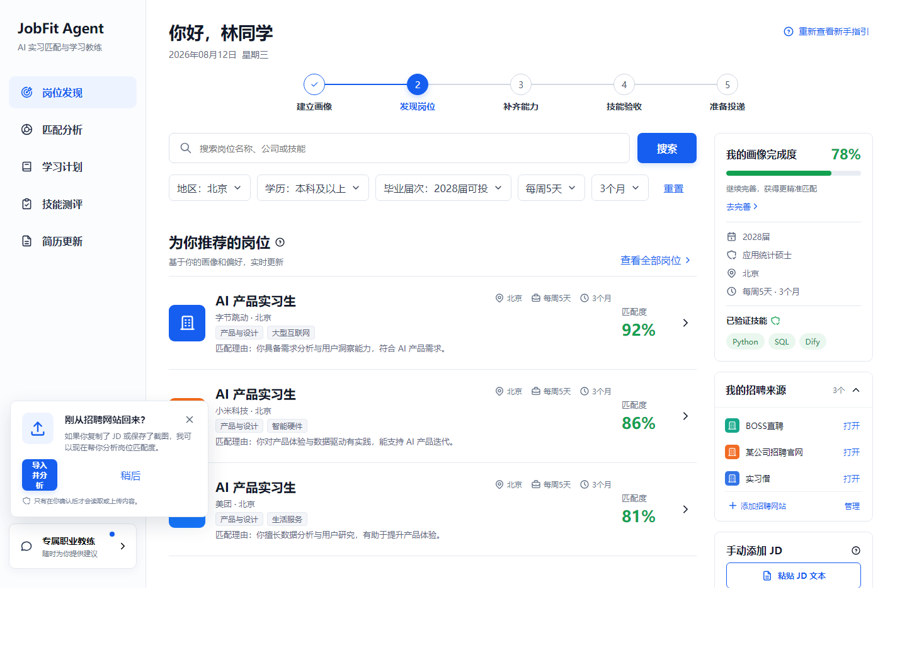

# JobFit Agent

面向实习求职者的岗位匹配与面试冲刺 Agent。当前版本已经跑通：

`粘贴陌生 JD → 结构化解析 → 画像匹配 → 缺失技能 → 学习资源 → 每日任务 → 动态测评`

## 在线体验

**[立即体验 JobFit Agent](https://jobfit-agent-demo.luminasunny7.chatgpt.site)**

公开体验默认使用无密钥的规则分析模式，可以完整演示岗位匹配、学习计划和动态测评，不会产生模型调用费用。本地配置 Kimi API Key 后可切换为大模型解析与联网搜索。



## 一键启动

在 PowerShell 中进入本目录，运行：

```powershell
.\start-jobfit.ps1
```

然后打开 <http://localhost:4173/>。后端接口文档位于 <http://localhost:8000/docs>。

## 开启 Kimi 大模型与联网搜索

1. 复制 `.env.example` 为 `.env`。
2. 在本机 `.env` 中填写 `KIMI_API_KEY`。不要把 Key 发到聊天、提交到 GitHub 或写入前端代码。
3. 重新启动后端。
4. 访问 `/api/health`；`mode` 为 `kimi` 表示配置成功。

Kimi 会先按 JD 和画像生成结构化分析，再通过内置 `$web_search` 搜索权威学习资料。模型输出会经过 Pydantic 校验；调用失败时自动回退到本地规则，页面不会中断。

## 手动启动

```powershell
.\.venv\Scripts\python.exe -m uvicorn backend.app.main:app --host 127.0.0.1 --port 8000
npm run dev -- --host 0.0.0.0 --port 4173
```

## 验证

```powershell
.\.venv\Scripts\python.exe -m pytest backend\tests -q
npm run build
```

当前真实入口优先支持“粘贴 JD 文本”和 TXT 文件。PDF、DOCX、截图 OCR、简历文件解析和正式部署属于下一阶段。
